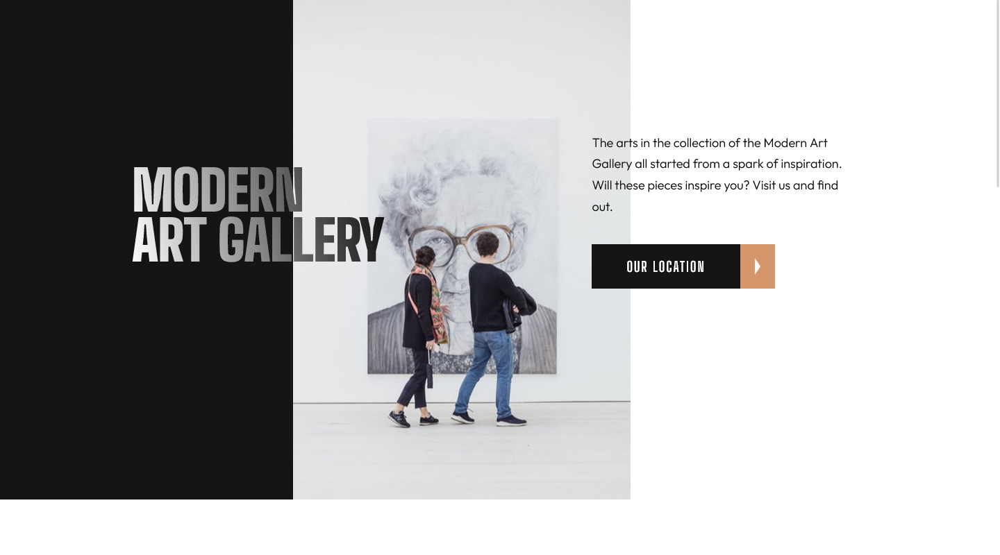
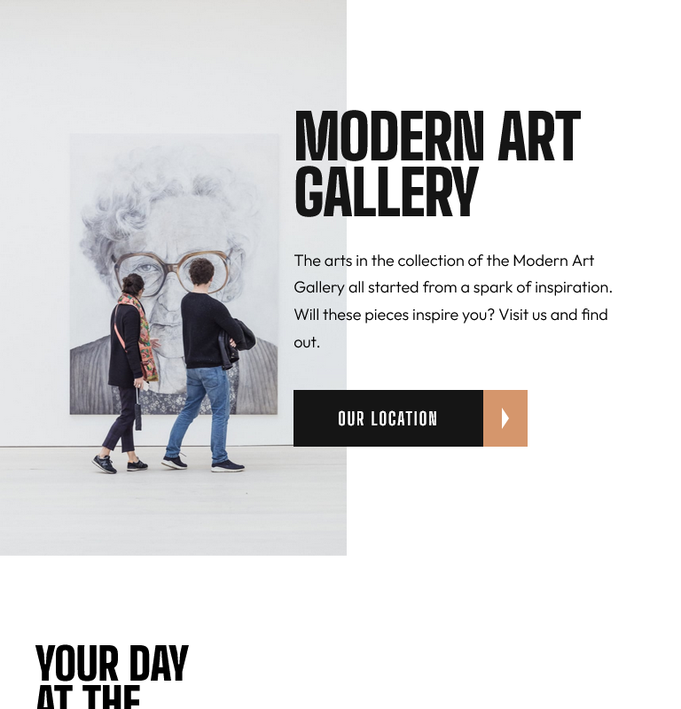

# Frontend Mentor - Art gallery website solution

This is a solution to the [Art gallery website challenge on Frontend Mentor](https://www.frontendmentor.io/challenges/art-gallery-website-yVdrZlxyA). Frontend Mentor challenges help you improve your coding skills by building realistic projects.

## Table of contents

- [Frontend Mentor - Art gallery website solution](#frontend-mentor---art-gallery-website-solution)
  - [Table of contents](#table-of-contents)
  - [Overview](#overview)
    - [The challenge](#the-challenge)
    - [Screenshot](#screenshot)
    - [Links](#links)
  - [My process](#my-process)
    - [Built with](#built-with)
    - [What I learned](#what-i-learned)
  - [Author](#author)

## Overview

### The challenge

Users should be able to:

- View the optimal layout for each page depending on their device's screen size
- See hover states for all interactive elements throughout the site
- **Bonus**: Use [Leaflet JS](https://leafletjs.com/) to create an interactive location map with custom location pin

### Screenshot

### Links

- Solution URL: [Add solution URL here](https://github.com/Nghuynh07/art_gallery)
- Live Site URL: [Add live site URL here](https://glittery-starship-29c0f4.netlify.app/)

## My process

- As always I started out by planning the project. This incudes: grouping elements together so it becomes easier when screen size changes, folder structures, install sass, class names naming.
- I always want to have my looks how it supposed to look before adding functionality. This means write scss and styling all elements and pages.
- I have learned about lazy loading images before and used it once on my portfolio. For this project since large size images are provided I assume lazy loading images is part of the challenge. For this I use intersecting observer api and srcset on img element. When the viewport intersect with the threshold then the img src becomes srcset (where I hide larger size image). In addition, I also add/remove extra class to animation as it the viewport enter/leave the element.
- Leafletjs isn't available at the moment so I did not attempt this part of the challenge

### Built with

- Semantic HTML5 markup
- CSS custom properties
- Flexbox
- CSS Grid
- Mobile-first workflow

### What I learned

- My previous project was on the Dine Restaurant, I had trouble with images in flexbox getting too big for the screen size. For this project I want to get a better at understanding how images behave in flexbox. Setting max-height on an image a break point will prevent it expanding larger than it needs to be. Object-position and object-fit play a big role in these images staying in its parent container. Flexbox item will want to use as must space as it needs. It is better to set the flex container in rem than % so it container will stay a fixed size.
- I also u sed intersecting observer API for this project. Although I have used this before on my portfolio but it was rough trying to understand. With this project, it was a lot easier.

## Author

- Website - [Huynh Nguyen](https://huynhtn.com/)
- Frontend Mentor - [@Nghuynh07](https://www.frontendmentor.io/profile/Nghuynh07)
- Twitter - [@huyniewin](https://twitter.com/huyniewin)
